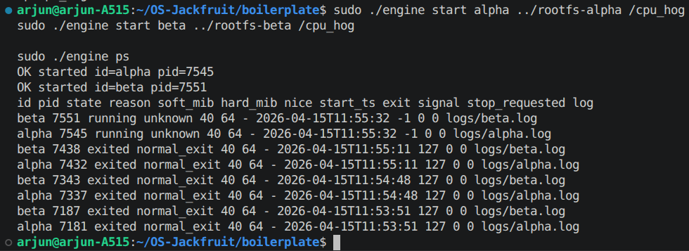
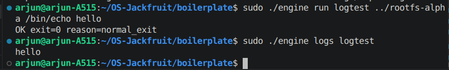
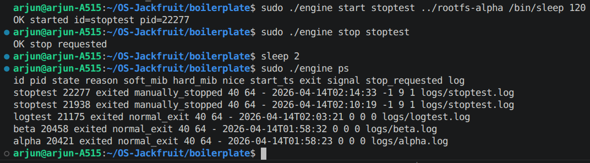
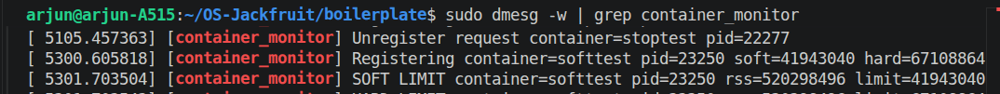
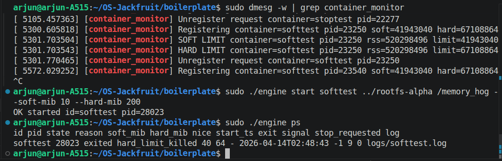
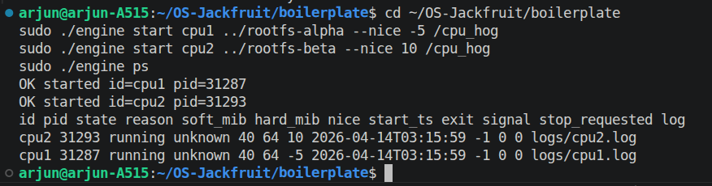
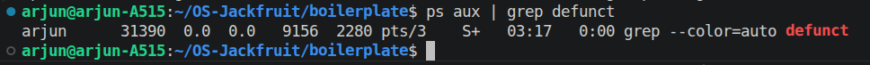

# OS-Jackfruit Runtime

## Team Information

Arjun Bhat — PES1UG24CS655  
Abhishek Aithal — PES1UG24CS651

---

## Project Overview

OS-Jackfruit is a lightweight multi-container runtime implemented in C. It demonstrates core operating system concepts including:

- namespace isolation using `clone()`
- filesystem isolation using `chroot()`
- process lifecycle supervision
- UNIX domain socket IPC
- bounded-buffer logging pipeline
- kernel-space RSS monitoring
- soft-limit warnings and hard-limit enforcement
- scheduler behavior experimentation using `nice` values
- clean teardown without zombie processes

The runtime consists of a long-running supervisor process that manages containers, a CLI interface for control operations, and a kernel module that enforces memory limits.

---

## Repository Layout

```
OS-Jackfruit/
├── boilerplate/
│   ├── engine.c
│   ├── monitor.c
│   ├── monitor_ioctl.h
│   └── Makefile
├── workloads/
│   ├── cpu_hog
│   └── memory_hog
├── screenshots/
├── README.md
└── project-guide.md
```

---

## Environment Setup

Required environment:

- Ubuntu 22.04 or 24.04 VM
- Secure Boot disabled
- No WSL

Install dependencies:

```bash
sudo apt update
sudo apt install -y build-essential linux-headers-$(uname -r)
```

---

## Full Reproducible Workflow

### 1) Build user space and kernel module

```bash
make -C boilerplate ci
make -C boilerplate module
```

### 2) Load kernel module

```bash
cd boilerplate
sudo insmod monitor.ko
ls /dev/container_monitor
```

### 3) Prepare root filesystem

```bash
cd ~/OS-Jackfruit
mkdir -p rootfs-base
wget https://dl-cdn.alpinelinux.org/alpine/v3.20/releases/x86_64/alpine-minirootfs-3.20.3-x86_64.tar.gz
tar -xzf alpine-minirootfs-3.20.3-x86_64.tar.gz -C rootfs-base

cp -a rootfs-base rootfs-alpha
cp -a rootfs-base rootfs-beta
```

### 4) Start supervisor

```bash
cd boilerplate
sudo ./engine supervisor ../rootfs-base
```

### 5) Launch containers

```bash
sudo ./engine start alpha ../rootfs-alpha /bin/sleep 120
sudo ./engine start beta ../rootfs-beta /bin/sleep 120
sudo ./engine ps
```

### 6) Logging verification

```bash
sudo ./engine run logtest ../rootfs-alpha /bin/echo hello
sudo ./engine logs logtest
```

### 7) Stop containers

```bash
sudo ./engine stop alpha
sudo ./engine stop beta
sudo ./engine ps
```

### 8) Inspect kernel messages

```bash
sudo dmesg | tail
```

### 9) Unload kernel module

```bash
sudo rmmod monitor
```

---

## CLI Contract

```
engine supervisor <base-rootfs>
engine start <id> <container-rootfs> <command> [--soft-mib N] [--hard-mib N] [--nice N]
engine run <id> <container-rootfs> <command> [--soft-mib N] [--hard-mib N] [--nice N]
engine ps
engine logs <id>
engine stop <id>
```

Defaults:

- soft limit = 40 MiB
- hard limit = 64 MiB

---

## Screenshots Included

### Multi-container supervision


Shows supervisor managing multiple containers simultaneously via `engine ps`.

---

### Metadata tracking



Displays PID, state, timestamps, limits, exit reason, and log path tracked by supervisor.

---

### Logging pipeline



Shows stdout/stderr capture and retrieval using `engine logs`.

---

### CLI IPC stop attribution



Demonstrates graceful termination through `engine stop` recorded as `manually_stopped`.

---

### Soft-limit warning



Kernel module warning triggered after RSS exceeds configured soft limit.

---

### Hard-limit enforcement



Kernel module terminating container after exceeding configured hard limit.

---

### Scheduling experiment



Shows effect of different `nice` priorities on concurrent CPU workloads.

---

### Clean teardown without zombies



Confirms absence of zombie processes after container termination.

---

## Engineering Analysis

### Isolation Mechanisms

Containers use PID, UTS, and mount namespaces. PID namespaces isolate process trees, UTS namespaces isolate hostname state, and mount namespaces isolate filesystem views. `chroot()` ensures each container sees its own root filesystem. All containers still share the host kernel.

### Supervisor Lifecycle Management

A persistent supervisor tracks containers, handles `SIGCHLD`, updates metadata, and reaps children using `waitpid()` to prevent zombies. Exit reasons are classified using the `stop_requested` flag.

### IPC and Synchronization

Control communication uses UNIX domain sockets between CLI and supervisor. Logging uses pipes feeding a bounded-buffer producer-consumer queue protected by mutexes and condition variables, preventing corruption, overwrite, and deadlock.

### Memory Enforcement Rationale

RSS represents resident physical memory in RAM. Soft limits generate warnings while hard limits trigger termination. Enforcement occurs in kernel space because the kernel has authoritative memory accounting and signal privileges.

### Scheduling Behaviour

Linux Completely Fair Scheduler distributes CPU proportionally based on `nice`. Lower nice values receive higher CPU share, demonstrated experimentally with competing CPU-bound workloads.

---

## Scheduler Experiment Results

Concurrent run:

| Container | Nice | Result |
|----------|------|--------|
| fast | -5 | exited first |
| slow | 10 | exited later |

Baseline measurement:

```
real    0m5.010s
```

Result confirms expected CFS priority-based scheduling behaviour.

---

## Hard-limit Enforcement Evidence

Example metadata output:

```
hardkill 40774 exited hard_limit_killed 10 16 logs/hardkill.log
```

Kernel log evidence:

```
SOFT LIMIT container exceeded RSS threshold
HARD LIMIT container terminated via SIGKILL
```

Confirms correct kernel enforcement behaviour.

---

## Cleanup Guarantees

Supervisor ensures:

- SIGCHLD reaping
- descriptor cleanup
- thread joins
- metadata removal
- kernel unregister calls

Verification:

```bash
ps aux | grep defunct
```

No zombie processes remain after teardown.

---

## Design Decisions and Tradeoffs

### Namespace Isolation

Choice: PID, UTS, mount namespaces  
Tradeoff: no network namespace isolation  
Justification: sufficient conceptual coverage with lower implementation complexity

### IPC Channel

Choice: UNIX domain sockets  
Tradeoff: local-only communication  
Justification: lower overhead and simpler design

### Logging Pipeline

Choice: bounded-buffer producer-consumer threads  
Tradeoff: requires synchronization logic  
Justification: guarantees correctness under concurrency

### Kernel Monitor

Choice: timer-based RSS enforcement module  
Tradeoff: higher implementation complexity  
Justification: accurate kernel-level accounting

### Scheduling Experiment

Choice: `nice` priority manipulation  
Tradeoff: coarse-grained control  
Justification: direct interaction with Linux scheduler

---

## Results Summary

This runtime demonstrates:

- concurrent container supervision
- namespace isolation
- CLI IPC control channel
- bounded-buffer logging pipeline
- kernel RSS monitoring
- soft-limit enforcement
- hard-limit enforcement
- scheduler priority propagation
- clean teardown without zombies
- correct lifecycle metadata tracking
